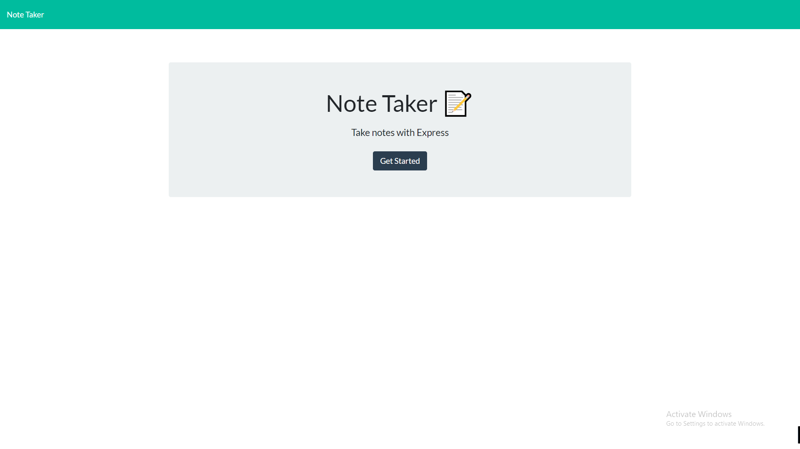

# Notes-For-Days

## Description

A simple note taking website. Add and delete notes at your command.
Access the website [here](https://notes-for-days.herokuapp.com/)

## Table of Contents
  
* [Preview](#preview)
* [Usage](#usage)
* [License](#license)
* [Contributing](#contributing)
* [Tests](#tests)
* [Questions](#questions)
  
## Preview

 

## Usage

  Just for anyone who would like to keep notes for themselves but doesn't want to use paper.

## License

## Contributing

Shoutout to the GT-FT 08/2020 Discord crew for good jokes and even better problem solving skills.

## Tests

  None

## Questions

* To contact me for any additional questions:
  * My GitHub username is MBPJason
  * The link to my page is [here](https://www.github.com/MBPJason)
  * To email me my email is cjozulumba@gmail.com
